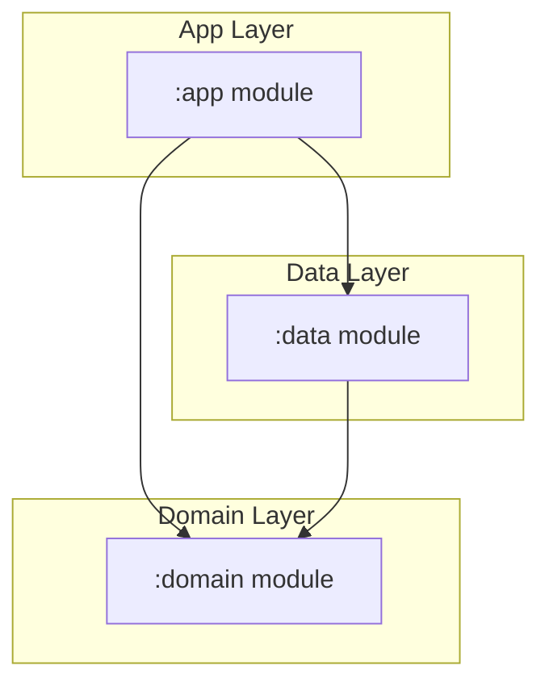

# Moviy - Discover Movies

Moviy is a native Android application built with **Kotlin**, **Jetpack Compose**, and **Material 3**, 
utilizing **Clean Architecture** combined with the **MVI (Model-View-Intent)** presentation
pattern. It connects to The Movie Database (TMDB) API to fetch and display movies, trailers, and
user reviews.

---

## Architecture Design & Modularization

The project is structured into three distinct modules to physically enforce a clean separation of
concerns and maintain a modular codebase:



### 1. `:domain` Module

A **pure Kotlin/JVM library** containing the core business rules. It has zero dependencies on
Android frameworks or libraries.

- **Models**: Clean domain data models (`Movie`, `Genre`, `Review`, `Video`).
- **Repositories**: Interfaces for data contracts.
- **Use Cases**: Self-contained business workflows (e.g., `GetDiscoverMoviesUseCase`,
  `ToggleFavoriteUseCase`).

### 2. `:data` Module

An **Android Library** that manages network communications and persistent local cache
implementations.

- **DTOs**: Data Transfer Objects suffixed with `Dto` for API parsing.
- **Remote APIs**: Retrofit endpoints and client configs.
- **Local Persistence**:
    - **Room Database** for favorited movies (`MovieEntity`, `MovieDao`).
    - **Jetpack Preferences DataStore** for category caching.
- **Repository Implementations**: Concrete classes coordinating network fetches and cached data
  fallbacks.
- **Dagger Hilt Modules**: Data source and database providers bindings.

### 3. `:app` Module

An **Android Application** containing the UI layouts, presentation state logic, and DI bindings.

- **MVI Contract & ViewModels**: ViewModels mapping intent pipelines and updating immutable UI state
  streams.
- **Jetpack Compose UI**: Stateless screens and design tokens (`Dimens`, `Color`, `Type`, `Theme`)
  that completely decouple UI layout from raw hardcoded dimensions.
- **Navigation Graph**: Nested tab navigation graphs configured using the Jetpack Navigation
  library.

---

## Key Features

1. **Discover Genres List**: An adaptive grid of official genres, loaded with linear gradients. It is cached in Preferences DataStore for offline capability.
2. **Movie Discovery Grid**: Displays movie posters filtered by genre. Features rating badges, endless scroll pagination, inline retry blocks on network errors, and robust Room-backed offline caching.
3. **Debounced Search**: Title search debounces inputs by 500ms to avoid unnecessary API overhead, coupled with full pagination and query-level offline caching.
4. **Movie Details Screen**:
    - Backdrop image blending with transparent gradient overlays.
    - Hardware-accelerated sliding collapsing toolbar.
    - Native, lifecycle-aware YouTube trailer video player.
    - Endless paginated list of user reviews.
5. **Favorites Tab**: Exposes a reactive Room database flow, rendering local favorited movies in a
   responsive grid with empty state illustration helpers.

---

## Instagram-style Navigation Flow

The app features a custom bottom bar navigation configured
inside [MainActivity](app/src/main/java/id/my/hizari/moviy/MainActivity.kt):

- **Nested Stack Preservation**: Switches graphs using `restoreState = true` and `saveState = true`,
  ensuring tab state (scroll position and depth) is preserved.
- **Tab-Local Details**: Detail screens are registered as separate routes inside the Discover and
  Favorites graphs (`discover_detail/{movieId}` and `favorites_detail/{movieId}`). Clicking a movie
  under Favorites keeps the navigation local to the Favorites tab backstack.
- **Dynamic Tab History Back Press**: Back presses are intercepted on tab roots using a
  `BackHandler` and a custom saveable `tabHistory` stack (resilient to orientation changes).
  Pressing back navigates through recently visited tabs instead of immediately exiting.
- **Active Tab Re-selection**: Clicking the active bottom bar icon pops the stack back to the tab's
  start destination.

---

## API Key Security Setup

To secure secrets and prevent TMDB key leaks:

1. Open the **`local.properties`** file in the root directory (which is git-ignored).
2. Add the following entry:
   ```properties
   TMDB_API_KEY=your_tmdb_api_key_here
   ```
3. If the key is not defined, the app displays a clear warning screen with instructions instead of
   crashing.
4. **CI/CD runners**: If the file does not exist, the Gradle build script automatically falls back
   to system environment variables.

---

## Technical Specifications

- **SDK target/compile version**: `37`
- **Dependency Injection**: Dagger Hilt using Kotlin Symbol Processing (KSP).
- **Network Stack**: Retrofit & OkHttp.
- **Local Databases**: Room (SQLite) & Jetpack Preferences DataStore.
- **Image Loading**: Coil.
- **Testing Tools**: JUnit 4 & MockK.

---

## Verification & Testing

### 1. Compile & Build Project

To assemble the debug build and verify compile configurations:

```bash
./gradlew assembleDebug
```

### 2. Run Unit Tests

To run the full unit test suite (covering ViewModels, Use Cases, Repositories, and DTO Mappers):

```bash
./gradlew test
```

All business logic is isolated and verified using MockK mocking frameworks.

### 3. Continuous Integration

This project uses **GitHub Actions** for Continuous Integration. On every push and pull request
targeting the `main` branch, the unit test suite is automatically executed. The workflow
configuration is located in [.github/workflows/test.yml](.github/workflows/test.yml).

